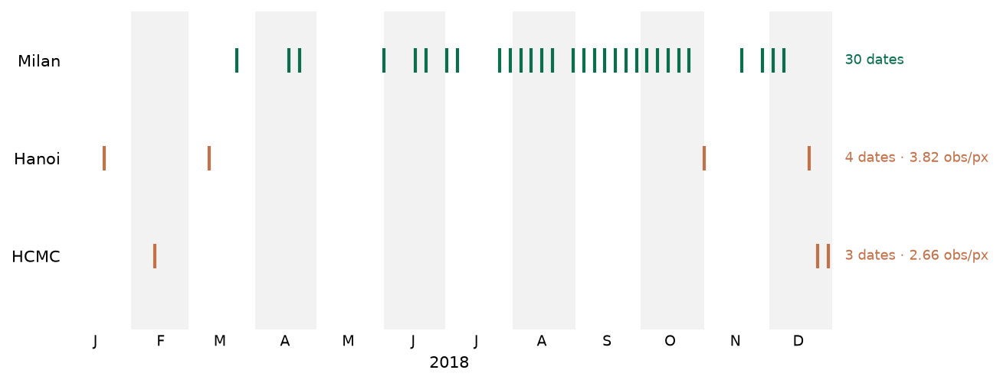
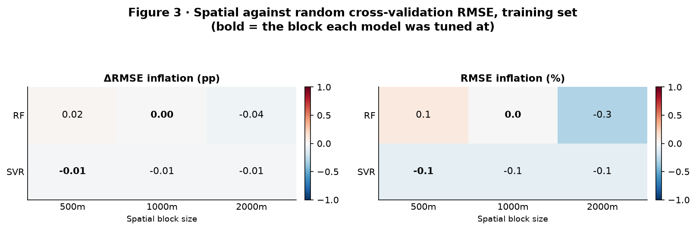
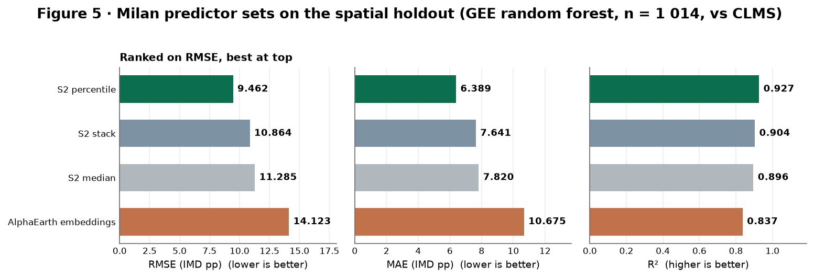
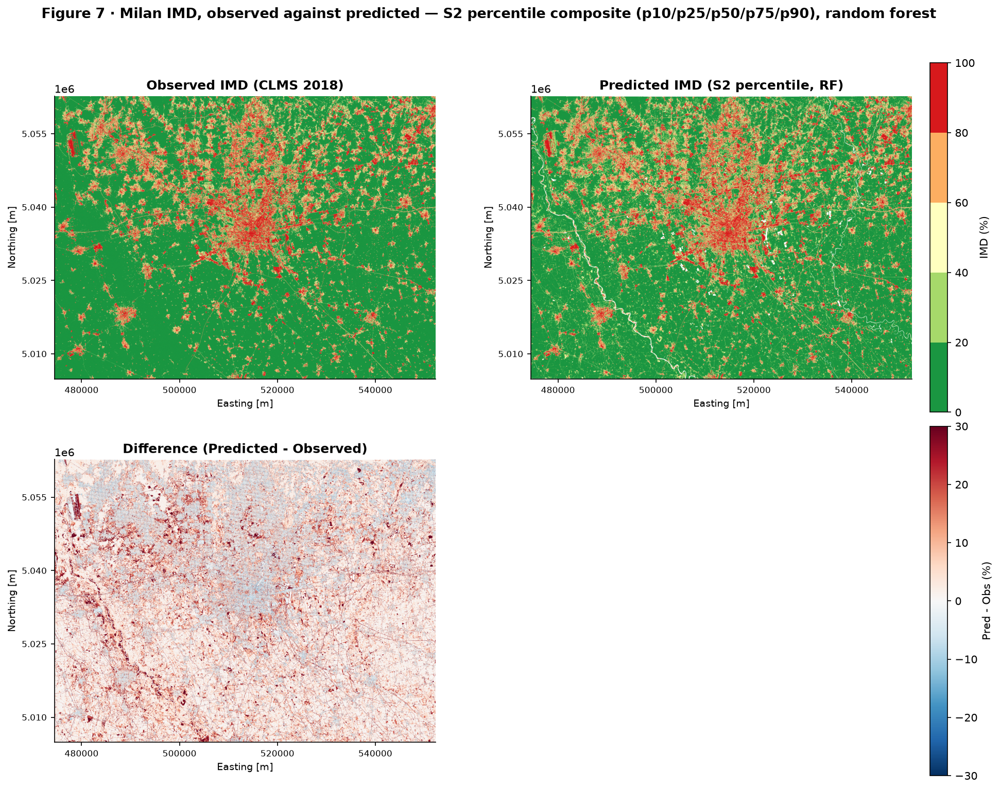
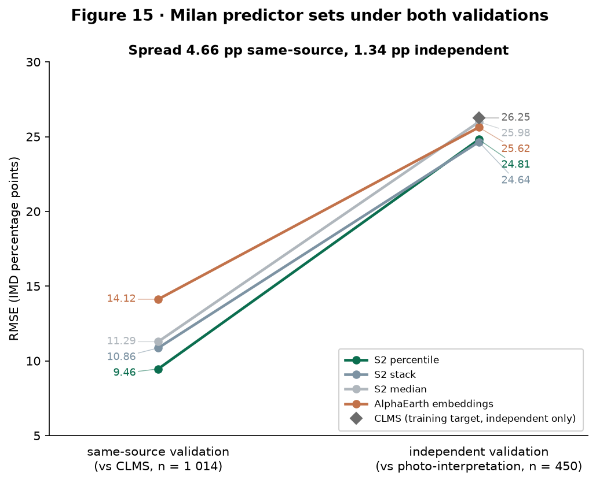
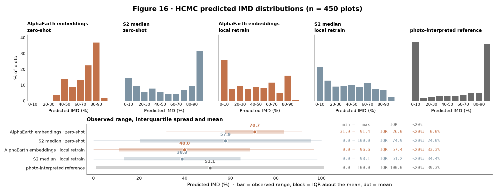
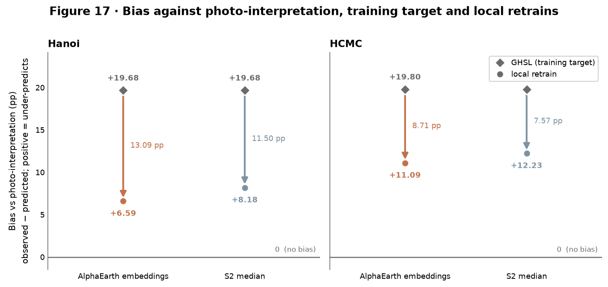

# Impervious surface density from Sentinel-2 composites and AlphaEarth embeddings: Milan, Hanoi and Ho Chi Minh City, 2018

## 1. Introduction

Impervious surface density is the share of a pixel that is sealed against
infiltration, and it is the quantity this report maps for three cities in 2018:
Milan, Hanoi and Ho Chi Minh City. The work supports the ITALY-VIETNAM project on
Local Climate Zones, Urban Heat Island and Geomatics (LCZ-UHI-GEO, CUP
D47G24000110001), which is why those three cities and that year. A
high-resolution imperviousness layer is an input to that project's wider
objectives, being relevant to local climate zone characterisation and to urban
heat island analysis in the Vietnamese cities (Žgela p. 11).

The study extends an earlier one. Mapping impervious density from AlphaEarth
satellite embeddings in Milan was established by Žgela, whose report is the
companion to this one and is assumed read. This project changes three things.
It adds explicit Sentinel-2 composites as an alternative predictor set, so that
a learned general-purpose representation can be compared against reflectance
statistics chosen for this task. It extends the work to two Vietnamese cities,
which turns a single-city study into a test of whether a model transfers. And it
adds a second validation against photo-interpreted plots that no model saw,
which is what allows the difference between agreement and accuracy to be
measured rather than assumed.

### Attribution

The AlphaEarth method and the shared Milan sample set are Žgela's work and are
used here as supplied. The 3 500-point stratified sample, the spatial blocking
and buffering that separate training from test, and the treatment of the
64-dimensional embedding are all his design, described in Sections 2.2 and 3.1
with citations rather than re-derived. Several results in this report are
reproductions of his and are labelled as such where they appear: the
cross-validation against holdout reversal in Section 4.2, the per-class pattern
of local retraining in Section 5.2, and the qualitative observation behind the
bias recovery of Section 7.3.

The embeddings pipeline was independently re-run in this project. It reproduces
his published holdout figures exactly, for both estimators. The random forest
gives RMSE 14.123, MAE 10.675, R² 0.837 and bias +0.624 against his reported
14.12, 10.68, 0.837 and +0.62; the support vector regressor gives 14.756,
11.400, 0.822 and +0.274 against his 14.76, 11.40, 0.822 and +0.27 (Žgela p. 5).
Every figure matches to the precision at which he published it.

This is recorded as verification that the shared baseline is correctly
reconstructed, and it is not a new result. Its purpose is narrow and worth
stating plainly: every comparison in Sections 4 and 7 measures a new predictor
set against that baseline, so a baseline that had drifted would move those
comparisons without announcing itself. The reproduction establishes that it has
not drifted. Nothing about the embeddings is being claimed here beyond what
Žgela already established.

### What this report finds

The results are summarised here because two of them qualify each other, and a
reader who takes the first without the second will overstate what the study
shows.

Against CLMS in Milan, all three Sentinel-2 composites outperform the AlphaEarth
embeddings, and the margin is wide. The percentile composite reaches an RMSE of
9.462 against the embeddings' 14.123, a reduction of 33 %, with the same ordering
on RMSE, MAE and R². The advantage is also mechanistically interpretable: it
comes from the low percentiles of the red band and the high percentiles of the
near infrared, which are precisely the quantiles a median composite discards.

That margin is measured against the product the models were trained on, and it
does not survive the change of reference intact. Scored against photo-interpreted
plots instead, the four-way spread between predictor sets compresses about
6.4-fold, from 33.0 % to 5.2 % of the worst map, and the ordering partly
reshuffles.
Most of what the first validation measured as separation between predictor sets
was agreement with CLMS rather than accuracy. The compression is not a
dissolution, however: paired testing on the same plots still resolves the four
maps into two distinguishable tiers. The honest statement, developed in Section
7.1, is that the advantage shrinks sharply and remains real.

Zero-shot transfer of a Milan-trained model to either Vietnamese city fails. The
transferred models score R² at or below zero in three of the four city and
predictor combinations, which is no more informative than predicting the mean
everywhere, and local retraining recovers R² to between 0.522 and 0.649 in every
case. The failure has a distributional mechanism rather than merely a
calibration one: the transferred embedding maps lose the low end of the
predicted distribution almost entirely, retaining 3.1 % of the reference's
sub-20 % mass in Hanoi and none of it in Ho Chi Minh City, and every local
retrain restores it. Retraining is not uniformly better, though. Above 80 %
imperviousness it is worse than the transferred model, which Section 5.2 reports
rather than sets aside.

Both training products, scored against photo-interpretation on the same terms as
the models, do no better than the models fitted to them. That measures the
quality of the labels and not a ceiling on the maps, and the two are distinct: a
model can outperform its own training target, and here it measurably does.
GHS-BUILT-S under-marks the interpreted reference by close to 20 percentage
points in both Vietnamese cities, largely because it excludes roads by design,
while the models fitted to it recover between 38 % and 67 % of that deficit.

### How to read this report

Two conventions carry through and are set out where they are defined, in
Sections 3.3 and 3.4.

The first is that every map is scored twice. Same-source validation scores a map
against the product it was trained on and measures agreement with that target.
Independent validation scores it against the photo-interpreted plots and
measures accuracy against a reference no model saw. Both are necessary, because
the first cannot distinguish a good map from one that merely resembles its
labels. They are never merged, and their numbers are never compared directly:
they are scored against different references on different samples, so a
difference between one and the other would measure the change of reference
rather than anything about a map. Sections 4 and 5 report the first, Section 6
the second, and Section 7.1 is the one place they are set side by side, with the
relationship between them as its subject.

The second is the sign of the bias. Bias is observed minus predicted throughout,
so a positive value means the reference is higher than the map and the map
under-predicts. The convention is identical in both validations, and the two
produce biases of opposite sign for reasons that are not a contradiction:
Section 5 reports negative biases where models read higher than GHS-BUILT-S, and
Section 6 reports positive ones where GHS-BUILT-S reads lower than the
interpreted reference. Those are different comparisons and the signs must not be
read across them.

Section 8 sets out five constraints that bound what the results support, each
stated with the conclusion it forbids. Two are worth flagging in advance because
they limit comparisons a reader might otherwise expect this report to make. The
Vietnamese Sentinel-2 composites are built from far fewer usable dates than
Milan's, so composite depth is confounded with predictor type there and the
ordering between the two predictor sets in Vietnam is not a controlled
comparison. And the validation plots are stratified rather than drawn at random
over each city, so the independent metrics compare maps against one another but
do not estimate city-wide accuracy.

## 2. Data

Four data sets enter this study: two impervious-density products used as
training targets, two predictor sets, and one set of photo-interpreted plots
used for validation alone. The first three are treated as Žgela treats them and
are described here only as far as is needed to follow the results; the fourth is
new to this project and is described in full.

### 2.1 Targets: CLMS and GHS-BUILT-S

The models are fitted to two different products. Milan uses the Copernicus Land
Monitoring Service imperviousness density layer for 2018, and Hanoi and Ho Chi
Minh City use GHS-BUILT-S for the same year. Both are supplied at 10 m and both
report a percentage per pixel, so they enter the modelling identically. What
they measure is not the same thing, and the difference is not noise.

CLMS measures sealed surface. Its target is the fraction of a pixel that water
cannot pass through, which includes roads, pavements, car parks and rooftops
alike. GHS-BUILT-S measures built-up surface, which is a narrower quantity.
Žgela states the consequence twice in his report and it is taken from him rather
than asserted independently here: the product does not include all impervious
surfaces such as roads, accounting only for built-up surfaces, namely buildings
and a limited set of other roofed infrastructure, and he describes this as an
inherent limitation of the chosen reference dataset (pp. 8, 10).

Roads are therefore in the Milan target and largely absent from the Vietnamese
one. This matters later. Section 6 scores both products against
photo-interpretation on the same terms as the models, and Section 7.3 measures
what the models recover of the resulting deficit. A reader who meets the
GHS-BUILT-S result there without having met this paragraph will read a
definitional mismatch as a measurement error.

The choice of GHS-BUILT-S was nonetheless the right one, and was made for a
stated reason rather than by default. Žgela records that no other suitable 2018
reference product existed for the two Vietnamese cities. Matching the label year
to the imagery year was treated as the binding constraint, and a target with a
known definitional gap was preferred to a target from the wrong year or to no
Vietnamese experiment at all.

### 2.2 AlphaEarth embeddings

The first predictor set is the AlphaEarth satellite embedding,
`GOOGLE/SATELLITE_EMBEDDING/V1/ANNUAL`, a 64-dimensional learned representation
supplied at 10 m. The collection is filtered to a single year and all 64 bands,
`A00` to `A63`, are taken as predictors. The method and its rationale are
Žgela's (pp. 3 to 5) and are not re-derived here.

Two properties of that treatment matter for what follows.

The first is that all 64 bands are used, without feature selection. Žgela tested
every band against the IMD groups by Kruskal-Wallis and found 60 of the 64 to
differ significantly across classes, and a separate feature-selection experiment
found the full set to outperform any reduced subset (pp. 3 to 5, Fig. 3). The
embeddings are therefore used whole in this project rather than pruned, and the
obvious question of whether a smaller subset would do as well has already been
answered in the negative on this same data.

The second is coverage. The embedding is an annual product and the same
one-year filter is applied in Milan, Hanoi and Ho Chi Minh City, so all three
cities receive identical treatment with no seasonal gap. Section 2.3 shows that
the Sentinel-2 side has no such symmetry, and Sections 5 and 7 both depend on
the difference: the embeddings transfer experiment compares annual coverage
against annual coverage, and the Sentinel-2 one does not.

### 2.3 Sentinel-2: search, screening and composites

The second predictor set is built from Sentinel-2 surface reflectance,
`COPERNICUS/S2_SR_HARMONIZED`, over each city's area of interest for 2018. Ten
bands are carried: B2, B3, B4, B5, B6, B7, B8, B8A, B11 and B12. The four
visible and near-infrared bands are native 10 m and the remainder are resampled
to the same grid.

Screening is per acquisition date and applies three criteria, each computed over
the city's area of interest after a scene classification mask that removes
cloud, cloud shadow, cirrus, snow, saturated and no-data pixels, with a cloud
probability gate at `MSK_CLDPRB < 40` on top. A date is kept when cloud cover
over the area of interest is below a threshold, when the share of valid pixels
is above a threshold, and when scene coverage of the area of interest is at
least 95 %. Milan passes at the strict setting: cloud below 20 % and valid above
90 %. Neither Vietnamese city yields a workable set at that setting, so both are
screened one rung looser, at cloud below 35 % and valid above 80 %.

What survives is very unequal. Milan retains 30 usable dates. Hanoi retains 4
and Ho Chi Minh City 3. Figure 1 shows them on the 2018 calendar.

Figure 1. Usable Sentinel-2 acquisitions per city after cloud screening, 2018.
Each tick is one retained date. Milan's 30 dates carry an average of 30
observations per pixel, Hanoi's 4 carry 3.82 and Ho Chi Minh City's 3 carry
2.66. Ho Chi Minh City's two December dates are five days apart and are one
effective look rather than two.
(`report/figs/fig_composite_depth.png`)

Three composite methods are defined over whatever dates survive. The median
composite reduces the stack per band to its median, giving 10 bands. The stack
composite takes four dates chosen one per season and concatenates them, giving
40 bands. The percentile composite reduces the stack to five percentiles per
band, p10, p25, p50, p75 and p90, giving 50 bands.

Only the first is computable in Vietnam. A percentile is only meaningful once
enough observations sit on either side of it, and the guard used here scales
with the number of percentiles requested: five percentiles require at least 17
dates. Hanoi's 4 and Ho Chi Minh City's 3 fall far short.

The shortfall is not a consequence of the screening thresholds, and this was
tested rather than assumed. The scene search evaluates a ceiling case in which
every threshold is disabled and every candidate acquisition is accepted
regardless of cloud, validity or coverage. Even then the 2018 archive holds only
10 dates over Hanoi and 16 over Ho Chi Minh City, against the 17 required.
Hanoi is short by 7 and Ho Chi Minh City by 1.

Ho Chi Minh City is worth stating explicitly, because it is the case that comes
closest and still fails. One further usable date would have brought it to the
threshold, and no threshold in the screening chain can produce that date: at the
ceiling nothing is being screened out, so the 16 dates are all the 2018 archive
holds over that area of interest. The margin is narrow and the conclusion is not
weakened by it. A composite computed from the ceiling set would in any case be
built from acquisitions rejected for cloud, which is why the screened count is
3 rather than 16.

The stack composite fails for the same reason at a smaller count, since it
requires four dates spread one per season and Ho Chi Minh City's three fall in
two months.

The median composite has no minimum date count, so it was the only method that
could be computed in Vietnam at all. This is an archive limitation and not a
modelling preference, and it should not be read as a finding that median is the
better choice in Vietnam: Section 4 shows it is the weakest of the three in
Milan, where all three could be computed.

Two further properties of these composites are recorded here because later
sections rest on them.

Milan's composite is near-annual rather than annual. January, February and May
are absent from all 30 dates, so the composite leans towards the growing season.
Describing it as annual would overstate its coverage.

Ho Chi Minh City's composite is thinner than a count of three suggests. Its
three dates are 12 February, 24 December and 29 December. The two December
acquisitions are five days apart and sample the same scene state, so the
composite is effectively one February look plus one late-December look, spanning
two months of twelve. Hanoi's four dates spread across four months. The
consequence is that the Milan median draws on about 30 looks per pixel while the
Vietnamese medians draw on between two and four, and Section 8 records what that
confounding forbids.

### 2.4 Photo-interpreted plots

The validation reference is a set of 450 photo-interpreted plots per city, 1 350
in total, produced by Keerthana Kirubakaran in Google Earth Pro on 2018 imagery
and labelled with EarthLabel. It is independent of every product above: no model
saw it at any stage, and it is used for validation alone.

A plot is a 10 m unit area, which is exactly one Sentinel-2 pixel and one pixel
of every map under test. Each plot is subdivided into a three-by-three grid of
nine sub-cells, and each sub-cell is interpreted individually and assigned a
land-cover code. The plot's IMD is then the percentage of its sub-cells that are
impervious. The nine sub-cells are never observations in their own right: they
are collapsed to one value per plot before anything is scored, so every metric
in Section 6 runs on 450 observations per city. One code, `Rock/material`, is
ambiguous between sealed and unsealed and is dropped wherever it occurs, with
the denominator renormalised so that a plot with one dropped sub-cell scores out
of eight rather than being discarded. It occurs once, in Milan.

Which codes count as impervious is a definitional choice rather than an
observation, so it is not fixed. Three rules are carried through the whole of
Section 6 and never averaged or collapsed:

- **strict**, the primary rule, counts parking, pavement, road, roof, railroad,
  airport and pool as impervious;
- **B** adds permeable pavement, which matches the sealed-surface definition
  CLMS works to;
- **C** adds unpaved dirt road and heavily compacted bare soil, on the ground
  that compacted surfaces behave hydrologically much as sealed ones do.

Paved roads and railroads are impervious under all three rules, including the
primary one. Only dirt roads move between rules, and only under C. This is worth
stating precisely, because it is what makes the GHS-BUILT-S comparison in
Section 6 a fair one: the reference counts paved roads as impervious under every
rule while the target excludes them by design, and no choice of rule removes
that mismatch.

The two additional codes are rare, which bounds how much the rule choice can
matter. In Milan permeable pavement occurs in 23 sub-cells across 6 plots and
dirt road in 112 sub-cells across 18 plots. In Hanoi and Ho Chi Minh City
permeable pavement does not occur at all, so rule B is identical to strict there
by construction rather than by coincidence; dirt road occurs in 63 sub-cells
across 13 plots in Hanoi and 34 across 10 in Ho Chi Minh City. Section 6.3
reports the sensitivity of the results to the choice.

## 3. Methods

### 3.1 Sampling, spatial blocking and buffering

The Milan point set is Žgela's and is used unchanged. His design is summarised
here rather than re-derived; the provenance and the rationale are his (pp. 2 and
4, Figs. 1 and 2).

The CLMS reference map was classified into seven IMD groups (0 %, 1 to 20, 21
to 40, 41 to 60, 61 to 80, 81 to 99 and 100 %) and 500 points were drawn at
random within each group, giving 3 500 points in total. Stratifying this way
rather than sampling uniformly is what puts enough points in the sparse middle
of the range, which an unstratified draw over a city would leave nearly empty.

Train and test are then separated spatially rather than at random. The area is
divided into 1 km by 1 km blocks and each block is assigned whole to either
training or testing, so no test point shares a block with a training point. A
250 m buffer is applied on top, removing test points that fall within 250 m of
any training point. What remains is 2 449 training points and 1 014 test points,
approximately a 70/30 split. Random splitting would place training and test
points metres apart in the same neighbourhood, where they share land cover and
often the same rooftops, and would return an accuracy figure that measures
interpolation between neighbouring pixels rather than prediction.

The design's own spatial randomness was checked by Žgela with an average nearest
neighbour index, which runs from 1.02 for the 0 % class down to 0.75 for the
100 % class. The lower value records that fully impervious pixels cluster in the
city centre, which he acknowledges as a limitation of the sampling rather than
correcting for it. It is repeated here on the same terms.

Two consequences for this report follow. The first is that the 1 014-point
holdout is the same holdout throughout Section 4, and the count is not a
coincidence of four separate splits agreeing: notebook 01b imports the split
from the embeddings run rather than recomputing it, so the four Milan predictor
sets are scored on exactly the same held-out points. That is what makes their
comparison a comparison of predictors. The second is that the 1 014 figure
matches the one Žgela reports, which is one of the checks that the shared
baseline was correctly reconstructed.

Figure 2. Training points, test points and buffer-removed points over the 1 km
block grid, Milan, with the class counts alongside. Blocks are assigned whole to
training or testing and test points within 250 m of a training point are
removed.
(`outputs_v2/fig01_spatial_split.png`)

Vietnam is sampled and split on the same design, against GHS-BUILT-S in place of
CLMS, giving 895 test points in Hanoi and 887 in Ho Chi Minh City.

### 3.2 Estimators, tuning and spatial cross-validation

Three estimators were tuned on the Milan data under a randomised hyperparameter
search with spatially aware five-fold cross-validation, at three block sizes:
500 m, 1 km and 2 km. Two are carried forward and reported here, a random forest
and a support vector regressor. Only estimators whose trained form can be
applied to a raster through Earth Engine's Python API were considered for the
final maps, since every map in this report is produced by predicting over the
full scene in Earth Engine rather than by scoring a table of points.

The scope of each estimator is fixed once, here, and holds for the rest of the
report. SVR is evaluated in Milan only. Every model outside Section 4 is a
random forest. Two reasons make that necessary rather than convenient. The
transfer experiment of Section 5 requires a random forest by construction, so
the Milan model carried to Hanoi and Ho Chi Minh City must be one. And the
comparison the report is built on, across predictor sets, across scenarios and
across cities, is only a comparison of those things if the estimator is held
fixed, since a difference between a random forest map and an SVR map cannot be
attributed to the predictor set. The independent validation of Section 6
likewise scores the random forest raster from every run for the same reason.

Cross-validation is spatial throughout, using the same block structure as the
train/test split, so a fold boundary is a spatial boundary. The point of doing
so is to prevent the tuning score from being inflated by spatial
autocorrelation, and whether it worked is measurable: Figure 3 compares
cross-validation RMSE under spatial folds against random folds, per estimator
and per block size.

Figure 3. Cross-validation RMSE under spatial blocking against random folds,
Milan training set, by estimator and block size. Bold marks the block size each
estimator was tuned at. Values are the difference in RMSE, in percentage points
on the left and as a percentage of the random-fold score on the right.
(`report/figs/fig_cv_inflation.png`)

The differences are negligible. The largest absolute inflation across the
reported estimators and all three block sizes is 0.3 %, and most cells are
smaller still. Spatial and random cross-validation agree to within about one per
cent, which says that the buffering and blocking of Section 3.1 have already
removed what leakage there was to remove, and that the tuning scores are not
inflated by proximity between folds. It does not say that spatial blocking was
unnecessary: the reason the two agree is that the split was built to make them
agree.

Cross-validation scores are used for tuning and are never quoted as holdout
performance. They score scikit-learn models on training-set folds, whereas every
accuracy figure in Sections 4 to 6 is scored on data held out from training.
Section 4.2 takes up the one place where the two disagree in direction.

### 3.3 Accuracy metrics

Four metrics are reported throughout. For n observations with reference values
y_i and predicted values ŷ_i, and with ȳ the mean of the reference values:

- **RMSE** = √( (1/n) Σ (y_i − ŷ_i)² ), the root mean squared error, in IMD
  percentage points;
- **MAE** = (1/n) Σ |y_i − ŷ_i|, the mean absolute error, in the same units;
- **R²** = 1 − Σ (y_i − ŷ_i)² / Σ (y_i − ȳ)², the proportion of reference
  variance the map accounts for;
- **Bias** = (1/n) Σ (y_i − ŷ_i), the mean signed error, in the same units.

RMSE and MAE differ in how they weight the error distribution. MAE averages the
absolute errors, so every plot contributes in proportion to how wrong it is.
RMSE squares first, so it is driven by the largest errors and a map with a few
gross failures scores worse on RMSE than on MAE. The two can therefore disagree
about which of two maps is better, and Section 6.1 contains a case where they
do. Both are reported rather than one, and neither is treated as the summary of
the other.

**Bias is observed minus predicted**, reference minus map. The sign convention
is stated here because it is the one thing in this section that a reader can
invert without noticing:

- a **positive** bias means the reference is higher than the map, so the map
  **under-predicts**;
- a **negative** bias means the map reads higher than the reference, so the map
  **over-predicts**.

The convention is identical in every notebook that produces a number in this
report, and nothing was harmonised after the fact: the definitions already
agreed. It matters because the two validations produce biases of opposite sign
and both are correct. Section 5 reports negative biases in Vietnam, where the
models read higher than GHS-BUILT-S. Section 6 reports positive biases for
GHS-BUILT-S itself, where the product reads lower than the interpreted
reference. Those are different comparisons, not a contradiction, and the signs
must not be read across them.

One derived quantity is reported alongside RMSE in the independent validation.
The photo-interpreted reference is itself measured with error: a plot's IMD is
the proportion of nine interpreted sub-cells that are impervious, so it is a
proportion estimated from nine draws and carries a sampling error of its own.
Treating those draws as independent gives a binomial standard error per plot,
and averaging its square across plots gives an estimate of the reference noise
variance. Subtracting that from the mean squared error before taking the root
gives **RMSE_corr**, the noise-corrected RMSE: an estimate of map error with the
reference's own measurement error removed.

`RMSE_corr` is an **upper bound** on map error rather than a point estimate, and
is used only as one. The independence assumption behind the binomial correction
does not hold: nine sub-cells within a single 10 m pixel share land cover and
are spatially correlated, so the binomial calculation understates the true
reference noise and the correction consequently removes less error than it
should. The true map error is therefore at or below `RMSE_corr`, and the correct
use of the figure is to say that a map's error is at most some value, never that
it equals it.

### 3.4 The two-validation design

Every map in this report is scored twice, against two different references, and
the distinction between them is the methodological hinge of the whole study.

**Same-source validation** scores each map against the product it was trained
on: CLMS in Milan, GHS-BUILT-S in Hanoi and Ho Chi Minh City. It runs on the
spatial holdout described in Section 3.1, 1 014 points in Milan, 895 in Hanoi,
887 in Ho Chi Minh City, which is held out from training but drawn from the
same product as the training labels. What it measures is agreement with the
training target. It is reported in Sections 4 and 5.

**Independent validation** scores every map against the photo-interpreted plots
of Section 2.4, 450 per city, which no model saw at any stage and which were
produced from imagery rather than from either target product. What it measures
is accuracy against an independent reference. It is reported in Section 6.

Both are needed, and neither substitutes for the other. Same-source validation
is available for every candidate model, uses the full spatial holdout, and is
the natural instrument for choosing among models. What it cannot do is
distinguish a good map from one that merely resembles its labels. A model scored
against the product it was fitted to is rewarded for reproducing that product,
including wherever the product is wrong, and a map that reproduces a systematic
error in its target scores well for doing so. That limitation is not a
hypothetical here: Section 6 finds that both training products, scored against
photo-interpretation on the same terms as the models, do no better than the
models fitted to them.

Independent validation answers the question same-source validation cannot, at
the cost of a much smaller sample, a stratified rather than area-weighted one,
and a reference carrying interpretation error of its own. Section 8 records
those costs.

The two are never merged and their numbers are never compared directly. They
are scored against different references, on different samples, at different
sizes, and a difference between a same-source number and an independent one
would measure the change of reference rather than anything about a map. Every
table in this report belongs to one validation or the other and says which. The
one place the two are set side by side is Section 7.1, which is about the
relationship between them and treats the change from one to the other as its
subject rather than reading across it.

## 4. Milan results — same-source validation

All three Sentinel-2 composites outperform the AlphaEarth embeddings against
CLMS. The percentile composite reaches an RMSE of 9.462 against the embeddings'
14.123, a reduction of 33 %.

Three estimators were tuned under the same randomised search and spatial block
cross-validation; the two carried forward, random forest and SVR, are the ones
reported here. SVR appears in this section only. Every map outside Section 4 is
a random forest, because the transfer design in Section 5 requires one and the
independent validation holds the estimator fixed across runs so that the
comparison isolates the predictor set rather than confounding predictor with
estimator.

The numbers in this section come from a single validation: each Milan map scored
against CLMS, the product it was trained on, over the 1 014-point spatially
buffered holdout. They measure agreement with the training target and not
accuracy. Results against the photo-interpreted plots are an independent
validation and are reported in Section 6; the two are never compared directly.
In particular, the paired per-plot testing of these same four predictor sets is
independent validation work and belongs to Section 6.2.

### 4.1 Four predictor sets ranked

Table 1 gives the holdout metrics for the four Milan predictor sets under the
GEE random forest.

| Predictor set | RMSE | MAE | R² | Bias |
|---|---|---|---|---|
| S2 percentile (50 bands) | 9.462 | 6.389 | 0.927 | −0.104 |
| S2 stack (40 bands) | 10.864 | 7.641 | 0.904 | −0.169 |
| S2 median (10 bands) | 11.285 | 7.820 | 0.896 | 0.046 |
| AlphaEarth embeddings (64 bands) | 14.123 | 10.675 | 0.837 | 0.624 |

Table 1. Milan holdout metrics against CLMS, GEE random forest, n = 1 014.
Bias is observed minus predicted, so a positive value means the map
under-predicts.

The ordering is the same on RMSE, on MAE and on R², so it is not an artefact of
a single metric. Figure 5 shows the three metrics side by side, which is the
form in which that claim can be checked rather than taken on trust: the four
bars fall in the same order in all three panels. The gap between the best
composite and the embeddings, 4.661 RMSE, is larger than the gap between the
best and worst composite, 1.823. All four maps are close to unbiased on this
validation, between −0.169 and 0.624, which is expected of a model fitted to the
product it is then scored against.

The equivalent SVR rows follow the same ordering: percentile 9.051, stack
10.219, median 10.939, embeddings 14.756. The advantage of the composites over
the embeddings therefore does not depend on the estimator.

Figure 4 shows observed against predicted values on the holdout for the
percentile composite, and Figure 6 breaks the same run down by IMD class.

Figure 4. Observed CLMS against predicted IMD on the 1 014-point holdout, S2
percentile composite, random forest and SVR panels.
(`outputs_S2_percentile_p10p25p50p75p90/fig07_holdout_scatter.png`)

Figure 5. The four Milan predictor sets on the 1 014-point spatial holdout,
scored against CLMS under the GEE random forest, ranked on RMSE with the best at
the top. The same four values appear in Table 1. Bars start at zero on all three
panels, so bar length is proportional to the metric and the spread is not
exaggerated by a truncated axis. Section 7.1 returns to that spread, which
compresses sharply under the independent validation.
(`report/figs/fig_milan_predictor_ranking.png`)

Figure 6. RMSE, MAE and bias per IMD class, S2 percentile composite, GEE random
forest, scored against CLMS.
(`outputs_S2_percentile_p10p25p50p75p90/figC_perclass_GEE_RF.png`)

Figure 7 maps the percentile prediction against CLMS across the whole scene. The
two upper panels agree on the structure of the conurbation: the dense core, the
satellite towns to the north, and the largely agricultural south. The difference
panel is where the disagreement is legible. It is close to zero over most of the
rural area and over the interior of the built-up core, and departs from CLMS in
two places. The first is a fine network of positive lines threading the
countryside, following the road and canal network: the model reads these narrow
sealed features as more impervious than CLMS does. The second is a mild negative
cast over the densest part of the city centre, where the model sits below CLMS.
The predicted panel also carries small unmapped gaps along the watercourses that
CLMS fills. The map is qualitative support for Table 1 and not a measurement:
the whole-scene comparison is not the 1 014-point holdout the metrics are scored
on, and no number is quoted from it.

Figure 7. Milan IMD, observed CLMS against the predicted map and their
difference, S2 percentile composite, random forest. Positive difference means
the model reads more impervious than CLMS.
(`report/figs/fig_milan_raster_comparison.png`)

### 4.2 The CV-versus-holdout reversal

SVR wins cross-validation and loses the holdout. This reproduces Žgela's result
(p. 5) rather than adding to it: he reports SVR best on cross-validation with RF
close behind, then RF winning every holdout metric, and selects RF for that
reason.

The same reversal appears here. On the embeddings run SVR is tuned to a
cross-validation RMSE of 11.711 at its selected 500 m block, against RF's 13.162
at 1 000 m, so SVR leads by 1.451 on cross-validation. It then loses the holdout
on all three of RMSE, MAE and R²: 14.756 against 14.123 on RMSE, 11.400 against
10.675 on MAE, and 0.822 against 0.837 on R². The cross-validation values are
scores on training-set folds and are not comparable with the holdout figures in
Table 1; only the direction of each comparison is being read across them.

The reversal carries a confound that should be stated. The holdout rows are
scored on rasters built in Earth Engine by `smileRandomForest` and `libsvm`,
while the cross-validation numbers come from the tuned scikit-learn models, and
the parameter translation between the two is lossy in both directions. The
reversal may therefore reflect overfitting to the cross-validation folds, or it
may reflect how faithfully each Earth Engine estimator reproduces its
scikit-learn counterpart. The two cannot be separated from these runs.
Consistently with this, the embeddings run records SVR as its cross-validation
winner in metadata, while RF is the model carried downstream.

RF is carried forward because the transfer experiment in Section 5 requires a
random forest and the comparison across cities holds the estimator fixed
(Section 3.2). It is not carried forward because SVR could not be rastered: SVR
is supported in Earth Engine through `ee.Classifier.libsvm` with
`svmType='EPSILON_SVR'`, and the SVR raster for Milan was produced and retained.

### 4.3 Where the signal is

The percentile composite's advantage comes from the low percentiles of the red
band and the high percentiles of the near infrared, a seasonal signal that a
single median cannot express.

Table 2 gives the five most important bands of the percentile run by permutation
importance on the holdout, with mean decrease in impurity alongside.

| Rank | Band | Permutation importance | Impurity importance |
|---|---|---|---|
| 1 | B4_p25 | 0.1812 | 0.3518 |
| 2 | B4_p10 | 0.0556 | 0.1163 |
| 3 | B8_p90 | 0.0401 | 0.0664 |
| 4 | B4_p50 | 0.0225 | 0.0751 |
| 5 | B8_p75 | 0.0211 | 0.0446 |

Table 2. Top five bands by permutation importance, S2 percentile composite,
random forest, Milan holdout.

B4_p25 alone carries more than three times the permutation importance of the
next band. Four of the top five are low percentiles of red or high percentiles
of near infrared, which are precisely the quantiles a median composite discards.
That is a mechanistic explanation of the ranking in Section 4.1: the percentile
composite does not simply carry more bands than the median, it carries the
particular bands the median throws away.

The comparison with the embeddings run is instructive. There the two most
important predictors are bands B16 and B08 of the 64-dimensional embedding
(Žgela p. 6, Fig. 7), which have no physical interpretation. The Sentinel-2
composites give an interpretable answer to why they work; the embeddings do not.

Figure 8. Impurity and permutation importance per band, random forest, S2
percentile composite.
(`outputs_S2_percentile_p10p25p50p75p90/figD_importance_RF.png`)

## 5. Vietnam results — same-source validation

Zero-shot transfer of a Milan-trained model to Hanoi or to Ho Chi Minh City
fails. Local retraining is both necessary and sufficient to recover usable
accuracy.

Every model in this section is a random forest. SVR is not carried outside
Milan: the transfer design requires a random forest, and holding the estimator
fixed is what makes the comparison across cities and predictor sets a comparison
of predictors rather than of estimators.

As in Section 4, these are same-source numbers. Each Vietnamese map is scored
against GHS-BUILT-S, the product the local models were trained on, over that
city's spatial holdout. They measure agreement with the training target. Section
6 scores the same maps against photo-interpretation, and the two sets of numbers
are not compared.

### 5.1 Zero-shot versus local retrain

Table 3 gives both scenarios for both predictor sets in both cities.

| City | Predictor set | Scenario | RMSE | MAE | R² | Bias | n |
|---|---|---|---|---|---|---|---|
| Hanoi | AlphaEarth embeddings | zero-shot | 35.960 | 30.140 | −0.070 | −24.930 | 895 |
| Hanoi | AlphaEarth embeddings | local retrain | 23.860 | 17.720 | 0.529 | −0.690 | 895 |
| Hanoi | S2 median | zero-shot | 37.150 | 28.930 | −0.142 | −23.790 | 895 |
| Hanoi | S2 median | local retrain | 24.050 | 18.490 | 0.522 | −2.080 | 895 |
| HCMC | AlphaEarth embeddings | zero-shot | 40.650 | 34.170 | −0.279 | −29.760 | 887 |
| HCMC | AlphaEarth embeddings | local retrain | 21.310 | 16.580 | 0.649 | 0.400 | 887 |
| HCMC | S2 median | zero-shot | 35.190 | 26.980 | 0.042 | −23.180 | 887 |
| HCMC | S2 median | local retrain | 22.880 | 17.930 | 0.595 | −1.900 | 887 |

Table 3. Vietnam holdout metrics against GHS-BUILT-S, random forest. Bias is
observed minus predicted, so a negative value means the map over-predicts.

The zero-shot R² is at or below zero in three of the four city and predictor
combinations: −0.070 and −0.142 in Hanoi, −0.279 for the embeddings in HCMC. A
model with R² at or below zero is no more informative than predicting the mean
of the reference everywhere. The fourth combination, the S2 median in HCMC at
0.042, is not a counter-example so much as a weaker instance of the same
failure.

Local retraining recovers R² to between 0.522 and 0.649 in every case, and cuts
RMSE by roughly a third to a half: from 35.960 to 23.860 and 37.150 to 24.050 in
Hanoi, and from 40.650 to 21.310 and 35.190 to 22.880 in HCMC. The improvement
holds for both predictor sets and in both cities, which is what makes the
conclusion a statement about transfer rather than about a particular feature
space.

The bias column identifies the failure mode. Every zero-shot bias is large and
negative, between −23.180 and −29.760, so the transferred models read
systematically more impervious than GHSL across the whole test set. They are not
scattered around the reference; they sit above it. The local retrains bring bias
to between −2.080 and 0.400, near zero on all four. Section 7.2 takes up what
this level mismatch is and why it arises.

Both predictor sets fail in the same way and to a similar degree, so the failure
is not a property of the AlphaEarth embeddings or of the Sentinel-2 composites
specifically. One caveat belongs with that statement and is developed in Section
8: the two zero-shot experiments are not equally handicapped, because the
embeddings compare annual coverage against annual coverage while the S2 median
compares Milan's 30-date composite against 3 to 4 Vietnamese dates. Composite
depth is confounded with predictor type here, so the near-equality of the two
failures should not be read as a controlled comparison between them.

Figures 9 and 10 show the two predictor sets separately, on identical axes. They
are the same experiment run on different features, so they are read as a pair:
the shape of the result is the same in both, which is the point of Section 5.1.

Figure 9. **AlphaEarth embeddings.** Milan baseline, zero-shot transfer and
local retrain across all four metrics, Hanoi and HCMC. Every bar is scored
against the training target, GHS-BUILT-S in Hanoi and HCMC and CLMS for the
Milan baseline, and measures agreement with that target rather than accuracy. In
particular a bias bar near zero indicates agreement with GHSL, not a correct
map.
(`outputs_transfer_v2/fig01_transfer_comparison.png`)

Figure 10. **S2 median composite.** The same four metrics and the same two
scenarios as Figure 9, for the Sentinel-2 median predictor set rather than the
embeddings, and scored against the same targets: GHS-BUILT-S in Hanoi and HCMC,
CLMS for the Milan baseline. Again agreement with the target, not accuracy.
(`outputs_transfer_S2_median/fig01_transfer_comparison.png`)

Figure 11. GHS-BUILT-S, the Milan zero-shot transfer and the local retrain as
rasters, Hanoi and HCMC, **AlphaEarth embeddings**, scored against GHS-BUILT-S.
(`outputs_transfer_v2/fig_obs_vs_pred_hanoi_hcmc.png`)

### 5.2 Per-class behaviour

Breaking the same holdout down by IMD class shows that local retraining is not
uniformly better, and locates both where it helps and where it costs.

Retraining helps sharply in the low and middle classes. In Hanoi the embeddings
model's MAE in class C0 falls from 40.75 to 6.36, and in C1 from 50.08 to 20.12;
in HCMC C0 falls from 49.05 to 5.15. These are the classes where the transferred
model's high level does most damage, since a map that cannot predict low values
is worst where the reference is lowest.

Above 80 % imperviousness the ordering reverses. In Hanoi the embeddings model's
C6 MAE rises from 17.25 under zero-shot to 30.95 after retraining, and in HCMC
from 12.93 to 25.20. The S2 median behaves the same way: Hanoi C6 rises from
8.07 to 26.16 and HCMC C6 from 5.91 to 22.58. This is a real limitation of local
retraining and not noise. Žgela reports the same pattern (p. 9), with
improvements mainly in classes C0 to C3 and the retrained model challenged at
the top of the range.

The mechanism is visible in the same rows. The transferred models over-predict
everywhere, which is ruinous in the low classes and incidentally close to right
in the highest one, where the reference is near 100 % and a map biased upward
has little room to err. Retraining removes the upward bias globally, which fixes
the low classes and removes the accident that was flattering the top class.

Per-class R² is available but is not quoted here. Restricting to a single IMD
class removes most of the variance that R² is normalised by, so every defined
per-class value is negative even where the same model reaches a global R² of
0.522 to 0.649. That is arithmetic rather than model failure. Classes C0 and C6
are single-valued strata, so their variance is exactly zero and their R² is
undefined. Per-class RMSE, MAE and bias are the appropriate within-class
measures, and R² is reserved for the global comparison in Section 5.1.

Figure 12. MAE per IMD class, zero-shot transfer against local retrain, Hanoi and
HCMC, **AlphaEarth embeddings**, scored against GHS-BUILT-S. The S2 median
figures quoted in this subsection are read from that run's per-class table
rather than from a second copy of this figure.
(`outputs_transfer_v2/fig02_per_class_mae.png`)

## 6. Independent validation

Scored against photo-interpretation, the Milan spread that Section 4 reports
largely disappears, and the two training products score no better than the
models fitted to them.

This section is a second, independent validation and not a continuation of the
first. Every map in all three cities, models and training products alike, is
scored on 450 photo-interpreted plots per city that no model saw at any stage.
The reference is the same for every map in a city, which is what allows CLMS and
GHS-BUILT-S to appear here on the same terms as the models: in this validation
they are maps under test, not targets. As stated in Section 3.4, the two
validations are never merged, and no number in this section is compared with a
number from Section 4 or Section 5.

### 6.1 All fifteen maps

Table 4 gives every map under the primary strict rule.

| City | Map | Role | RMSE | RMSE_corr | MAE | R² | Bias |
|---|---|---|---|---|---|---|---|
| Milan | S2 stack | model | 24.644 | 21.559 | 16.551 | 0.652 | −3.344 |
| Milan | S2 percentile | model | 24.809 | 21.874 | 16.486 | 0.647 | −3.342 |
| Milan | emb_RF | model | 25.625 | 22.420 | 18.299 | 0.624 | −1.622 |
| Milan | S2 median | model | 25.984 | 22.917 | 18.363 | 0.613 | −4.176 |
| Milan | CLMS | reference | 26.253 | 24.411 | 14.606 | 0.605 | 2.263 |
| Hanoi | emb_localrf | model | 26.502 | 23.266 | 19.588 | 0.649 | 6.592 |
| Hanoi | S2_median_localrf | model | 27.282 | 23.885 | 21.320 | 0.628 | 8.181 |
| Hanoi | S2_median_zeroshot | model | 33.791 | 31.195 | 24.469 | 0.429 | −15.876 |
| Hanoi | emb_zeroshot | model | 34.352 | 31.061 | 29.537 | 0.410 | −15.716 |
| Hanoi | GHSL | reference | 40.345 | 38.833 | 27.052 | 0.187 | 19.680 |
| HCMC | S2_median_zeroshot | model | 25.950 | 23.420 | 16.779 | 0.665 | −6.827 |
| HCMC | emb_localrf | model | 27.242 | 24.011 | 20.294 | 0.630 | 11.088 |
| HCMC | S2_median_localrf | model | 29.615 | 26.484 | 23.030 | 0.563 | 12.233 |
| HCMC | GHSL | reference | 37.355 | 35.597 | 25.730 | 0.305 | 19.800 |
| HCMC | emb_zeroshot | model | 38.494 | 35.775 | 32.404 | 0.262 | −19.641 |

Table 4. All fifteen maps against 450 photo-interpreted plots per city, strict
rule. One plot is a 10 m unit area equal to one pixel, and plot IMD is the
percentage of its nine interpreted sub-cells that are impervious. Bias is
observed minus predicted, so a positive value means the map under-predicts the
interpreted reference. `RMSE_corr` is the binomial reference-noise correction
and is an upper bound on map error rather than a point estimate.

The Milan result is the compression. The four predictor sets span 24.644 to
25.984 RMSE, a range of 1.340. Their ordering is preserved from the same-source
validation only in part: S2 stack now leads on RMSE at 24.644 with S2 percentile
0.165 behind it at 24.809, and the AlphaEarth embeddings at 25.625 are no longer
the worst map, having been passed by the S2 median at 25.984. Section 7.1 takes
up what this compression means for model selection.

In Vietnam the spread is wider and its structure is different, because the maps
being compared differ in kind rather than only in predictor set. In both cities
the two local retrains sit well ahead of both zero-shot maps, at 26.502 and
27.282 in Hanoi against 33.791 and 34.352, which reproduces the Section 5
conclusion against a reference the models never saw. HCMC is the exception that
Section 7.2 accounts for: the S2 median zero-shot map records the city's best
RMSE at 25.950, ahead of both local retrains. That is a consequence of where the
city's reference level happens to fall relative to the transferred map's level
and not evidence that transfer succeeded there. The embeddings zero-shot map in
the same city is the worst of all fifteen at 38.494.

Figure 13 is the summary view, and carries the bootstrap confidence intervals
that the table omits. The Milan intervals overlap one another substantially, and
the Milan models' intervals overlap CLMS's.

Figure 13. RMSE and MAE with 95 % percentile bootstrap confidence intervals for
all fifteen maps, three cities, strict rule. Intervals are over 10,000
resamples of the 450 plots, the plot being the independent unit. Diamonds mark the training products, scored
here as maps rather than as targets; the tick on each RMSE bar is the
noise-corrected RMSE.
(`outputs_validation/fig02_forest_ci.png`)

The diamonds in that figure carry a result of their own. Both training products
score no better than the models fitted to them. CLMS reaches an RMSE of 26.253
in Milan, worse than all four of the Milan models it trained, the closest of
which is the S2 median at 25.984. GHS-BUILT-S reaches 40.345 in Hanoi and
37.355 in HCMC, worse than every local retrain in either city and, in Hanoi,
worse than every map of any kind. Its bias is +19.680 in Hanoi and +19.800 in
HCMC, so it under-marks the interpreted reference by close to 20 percentage
points in both cities. That is the road exclusion of Section 2.1 appearing as a
number.

One apparent counter-example needs settling, because CLMS holds the best MAE of
any Milan map at 14.606 alongside the worst RMSE at 26.253. Table 6 gives the
per-plot error distribution behind that split. CLMS is right far more often than
any model, landing within 5 percentage points of the interpretation on 53.3 % of
plots against 34.2 % for the closest model, and wrong by more when it is wrong,
carrying the largest share of gross errors at 8.7 % of plots above 50 percentage
points. That is a product resolving each plot decisively where the models fitted
to it hedge, which costs them where CLMS is nearly exact and saves them where it
fails badly; MAE rewards the first behaviour and RMSE penalises the second, so
the two metrics measure the two halves of one trade rather than contradicting
each other.

| Map | MAE | RMSE | Median error | p90 | Max | Within 5 pp | Over 50 pp |
|---|---|---|---|---|---|---|---|
| S2 stack | 16.55 | 24.64 | 10.38 | 39.37 | 96.26 | 32.7 % | 6.7 % |
| S2 percentile | 16.49 | 24.81 | 9.09 | 40.76 | 94.92 | 34.2 % | 6.7 % |
| emb_RF | 18.30 | 25.63 | 14.38 | 43.67 | 82.84 | 29.8 % | 7.3 % |
| S2 median | 18.36 | 25.98 | 12.17 | 41.49 | 94.41 | 21.8 % | 6.9 % |
| CLMS | 14.61 | 26.25 | 3.00 | 45.20 | 100.00 | 53.3 % | 8.7 % |

Table 6. Distribution of per-plot absolute error, Milan, strict rule, n = 450.
"Within 5 pp" and "over 50 pp" are the percentages of plots whose absolute error
falls below and above those thresholds.

What this measures is label quality. It says that the products these models were
fitted to disagree with careful photo-interpretation by about as much as the
models themselves do, which bears on where further gains are likely to come
from. It does not measure a ceiling on achievable model performance, and nothing
here should be read as one: a model is not confined to the accuracy of its
labels. Section 7.3 gives the mechanism and measures it.

Figure 14. Photo-interpreted reference against predicted IMD, every registered
map in the three cities, strict rule.
(`outputs_validation/fig01_scatter_grid.png`)

### 6.2 Two tiers under paired testing

The Milan four are not a clean ranking of four maps but two tiers of two: S2
stack with S2 percentile, and emb_RF with S2 median, indistinguishable within
each tier and separated between them.

This analysis is independent validation and belongs here rather than in Section
4. It runs on per-plot absolute error against the photo-interpreted reference,
so placing it beside the CLMS-scored holdout numbers of Section 4 would merge
the two validations that Section 3.4 keeps apart.

Table 5 gives the six Milan pairs, tested by paired Wilcoxon on per-plot
absolute error with Benjamini-Hochberg control of the false discovery rate
within the city.

| Map A | Map B | MAE A | MAE B | Median difference | p | q (BH) | Distinguishable |
|---|---|---|---|---|---|---|---|
| S2 median | S2 percentile | 18.36 | 16.49 | +0.92 | 5.95e-09 | 3.57e-08 | yes |
| S2 median | S2 stack | 18.36 | 16.55 | +1.07 | 4.33e-05 | 1.30e-04 | yes |
| emb_RF | S2 stack | 18.30 | 16.55 | +0.60 | 9.62e-04 | 1.92e-03 | yes |
| emb_RF | S2 percentile | 18.30 | 16.49 | +0.31 | 4.56e-03 | 6.84e-03 | yes |
| S2 stack | S2 percentile | 16.55 | 16.49 | +0.19 | 6.55e-01 | 7.86e-01 | no |
| emb_RF | S2 median | 18.30 | 18.36 | −0.64 | 7.90e-01 | 7.90e-01 | no |

Table 5. Paired Wilcoxon tests on per-plot absolute error, Milan, strict rule,
n = 450 plots. Median difference is the median of the paired per-plot
differences in absolute error.

Each of S2 stack and S2 percentile separates from each of emb_RF and S2 median,
with q between 3.57e-08 and 6.84e-03. Neither of the two within-tier pairs
separates: q = 0.79 for S2 stack against S2 percentile, and q = 0.79 for emb_RF
against S2 median.

Two points need stating explicitly, because Section 6.1 has just shown
overlapping confidence intervals for these same maps.

The first is that the paired test and the confidence intervals measure different
quantities, and both are correct. An interval describes the uncertainty of one
map's RMSE taken on its own, across resamples of the plots. The paired test
compares two maps on the same 450 plots, which removes the plot-level variance
common to both and therefore has more power to detect a consistent difference.
Overlapping intervals together with a significant paired difference is the
expected signature of a small difference that is nevertheless consistent
plot by plot, and not a contradiction.

The second is that the collapse reported in Section 6.1 and the tier structure
reported here are both true. The four-way spread falls from 4.661 RMSE on the
same-source validation, 33.0 % of the worst map at 14.123, to 1.340 on the
independent validation, 5.2 % of the worst map at 25.984 — a compression of
about 6.4 times. The spread shrinks sharply; it does not vanish. What survives
is small relative to each map's own error and still resolvable across 450 paired
plots. Neither half of that statement may be dropped.

### 6.3 Rule sensitivity

The conclusion does not depend on how the impervious classes are coded. Table 7
gives the Milan RMSE under all three rules with the resulting ranks.

| Map | Strict | B | C | Rank strict | Rank B | Rank C |
|---|---|---|---|---|---|---|
| S2 stack | 24.64 | 24.54 | 20.98 | 1 | 1 | 1 |
| S2 percentile | 24.81 | 24.71 | 21.37 | 2 | 2 | 2 |
| emb_RF | 25.63 | 25.54 | 23.03 | 3 | 3 | 4 |
| S2 median | 25.98 | 25.94 | 22.98 | 4 | 4 | 3 |
| CLMS | 26.25 | 25.97 | 24.08 | 5 | 5 | 5 |

Table 7. Milan RMSE against photo-interpretation under the three impervious
rules. Rule B adds permeable pavement to the strict coding, rule C adds unpaved
dirt road. Paved roads are impervious under all three.

Under rule B the ranking is unchanged. Rule B reclassifies 23 cells across 6
plots in Milan, and rule C reclassifies 112 cells across 18 plots, so B is much
the smaller perturbation. In Hanoi and HCMC the permeable-pavement code does not
occur at all, so rule B is identical to strict there by construction and only
rule C differs.

Under rule C the top two maps and CLMS hold their positions, while emb_RF and S2
median exchange third and fourth: 23.03 against 22.98, a difference of 0.05. The
two maps that swap are exactly the pair that Section 6.2 finds statistically
indistinguishable at q = 0.79. The swap is therefore a reordering within noise
and not a change of result.

All five Milan maps improve under rule C, by between 2.18 and 3.67 RMSE, and
CLMS is among them. Counting compacted dirt roads as impervious moves every map
closer to the reference, including the training target itself, which indicates
that the disagreement rule C resolves is in the reference coding rather than in
any particular map.

## 7. Discussion

### 7.1 From same-source to independent validation

Most of the separation between predictor sets that the same-source validation
reports is agreement with CLMS rather than accuracy. A real and resolvable
difference nonetheless survives the change of reference.

The size of the effect is the clearest way to see it. On the same-source
validation the percentile composite leads the AlphaEarth embeddings by 4.661
RMSE, 9.462 against 14.123. On the independent validation the same two maps are
24.809 and 25.625, a lead of 0.816. Across all four predictor sets the spread
falls from 4.661, which is 33.0 % of the worst map at 14.123, to 1.340, which is
5.2 % of the worst map at 25.984. That is a compression of about 6.4 times.
Figure 15 shows the four maps moving between the two validations.

Figure 15. The four Milan predictor sets, same-source RMSE against CLMS on the
1 014-point holdout on the left, independent RMSE against the 450
photo-interpreted plots on the right. CLMS is marked on the independent axis as
a map under test. The two axes are different measurements against different
references and the connecting lines trace each map's position within each of
them, not a change in its error.
(`report/figs/fig_samesource_vs_independent.png`)

Part of the collapse is a reshuffle rather than a compression. The worst map
differs between the two validations: the embeddings are last on the same-source
validation at 14.123, while on the independent validation the S2 median is last
at 25.984 and the embeddings sit third at 25.625. An ordering that survived
three metrics within the first validation does not survive the change of
reference intact.

The collapse should not be overstated in the other direction either. Section
6.2's paired testing resolves two tiers on exactly these data, with q between
3.57e-08 and 6.84e-03 between tiers and q = 0.79 within each. The residual
difference is therefore real and detectable, not lost in noise. Both halves of
that belong in the same sentence: the advantage of the better composites shrinks
sharply but does not disappear. It is small relative to each map's own error and
consistent enough across 450 paired plots to be significant.

The methodological conclusion follows from that pairing. The same-source
validation remains the right instrument for model selection: it is available for
every candidate, it uses the full spatial holdout, and it ranks the four
predictor sets in an order that the independent validation broadly, if not
exactly, endorses at the top. It is the wrong instrument for claiming accuracy,
because most of what it measures as separation is the degree to which each map
has learned to resemble CLMS. A 33 % reduction in same-source RMSE is a
statement about agreement with a particular product, and reporting it as a 33 %
gain in accuracy would misdescribe it by a factor of six.

### 7.2 Why transfer fails: level matching and the lost low tail

The transferred maps fail because their prediction level does not match the
target city, and because zero-shot transfer destroys the low end of the
predicted distribution. The second mechanism is the more damaging of the two and
holds in both cities.

The level argument is visible in the mean predicted values against the
interpreted reference. Both zero-shot maps inherit Milan's high level: 61.77 and
61.93 in Hanoi against a reference mean of 46.05, and 70.70 and 57.89 in HCMC
against a reference mean of 51.06. Both local retrains inherit GHS-BUILT-S's low
level, predicting between 37.87 and 39.97 across the two cities. The two
scenarios therefore straddle the reference from opposite sides, and which of
them scores better in a given city depends partly on where that city's own
reference level happens to fall between them.

Ho Chi Minh City is the case where this matters. The S2 median zero-shot map
records the city's best independent RMSE at 25.950, ahead of both local retrains
at 27.242 and 29.615. Its level gap is 6.83, the smallest of the four HCMC maps,
where the local retrains sit 11.09 and 12.23 below the reference. The zero-shot
map wins there because Milan's level happens to land closer to HCMC's reference
level than GHSL's does, not because the transfer worked. In Hanoi, where the
reference mean is lower at 46.05 and the zero-shot maps overshoot by close to 16
points, the same two scenarios reverse and the local retrains lead by six to
eight RMSE. A ranking that flips with the target city's level is a ranking set by
level matching.

The stronger evidence is the shape of the predicted distribution, because it does
not depend on level at all. Two properties are measured separately here: how much
of the reference's low tail a map retains, and how much of its spread. The first
is the share of the reference's sub-20 % mass the predicted raster reproduces,
the second the map's interquartile range against the reference's. They are
reported as measured quantities rather than as a threshold verdict, because the
two do not have to move together and here they do not.

| City | Map | Scenario | Tail retained | Spread retained |
|---|---|---|---|---|
| Hanoi | emb_zeroshot | zero-shot | 3.1 % | 37 % |
| Hanoi | S2_median_zeroshot | zero-shot | 30.6 % | 53 % |
| Hanoi | emb_localrf | local retrain | 136.0 % | 61 % |
| Hanoi | S2_median_localrf | local retrain | 124.4 % | 51 % |
| HCMC | emb_zeroshot | zero-shot | 0.0 % | 26 % |
| HCMC | S2_median_zeroshot | zero-shot | 68.7 % | 75 % |
| HCMC | emb_localrf | local retrain | 108.3 % | 57 % |
| HCMC | S2_median_localrf | local retrain | 104.0 % | 51 % |

Table 8. Low-tail and spread retention for the eight Vietnamese maps, computed
over the full predicted rasters, 8.4 million valid pixels in Hanoi and 8.2
million in HCMC. Tail retained is the map's share of pixels below 20 % IMD as a
proportion of the reference's share of plots below 20 %; spread retained is the
map's interquartile range as a proportion of the reference's. The tail figure
compares a raster-wide share against a 450-plot share, so it is read as an order
of magnitude rather than to the percentage point, and a value at or above 100 %
means the tail is fully present rather than oversized.

Both embeddings zero-shot maps have lost the low tail. Hanoi retains 3.1 % of the
sub-20 % mass its reference carries and HCMC 0.0 %; below 10 % both rasters are
empty to four decimal places. This is not a displaced distribution in either
city, because a shifted map would keep its spread and move only its centre. The
loss is therefore a property of the transferred embedding map rather than of one
city, which is what makes it a mechanism rather than an anecdote.

The two cities differ in how far the spread collapses alongside the tail. HCMC's
map holds 26 % of the reference interquartile range against Hanoi's 37 %, on
IQRs of 26.0 and 37.4 against a reference IQR of 100.0, and its standard
deviation is 15.95 against the reference's 44.81. HCMC is the severe case: the
range has narrowed around the missing tail as well as losing it. That severity is
visible in the scores, where the HCMC embeddings zero-shot map is the worst of all
fifteen at 38.494 despite a mean of 70.70 that is not absurd for the city.

The consequence is that no correction of level could repair either map. Both
references are strongly bimodal — 41.6 % of Hanoi plots below 10 % and 31.8 %
above 90 %, 37.3 % and 35.8 % in HCMC — and a map with no low tail cannot
represent the lower mode wherever its centre is placed. Shifting such a map
downward would move its mass off the upper mode without populating the lower one.

The complement of that result is what the local retrains do. All four reach a
raster floor of 0.00 and retain between 104.0 % and 136.0 % of the reference's
sub-20 % mass, which is full recovery of the low end within the precision this
comparison supports. The two mechanisms then state the failure cleanly and
symmetrically: zero-shot transfer destroys the low end of the distribution and
local retraining restores it, in both cities and for both predictor sets. That is
a stronger statement than either city alone would support, and it is the
distributional counterpart of the R² recovery reported in Section 5.1.

The S2 median zero-shot maps sit between the two, retaining 30.6 % of the tail in
Hanoi and 68.7 % in HCMC. They are degraded rather than emptied, which is
consistent with Section 5.1's finding that both predictor sets fail under transfer
while the embeddings fail harder. Section 8's caveat applies to that contrast: the
two zero-shot experiments differ in composite depth as well as in predictor type,
so the ordering between them is not a controlled comparison.

Figure 16 carries the argument for HCMC: the predicted distributions for the four
maps against the reference, with the level means annotated.

Figure 16. Distribution of predicted IMD over the 450 HCMC plots for the four
maps and the photo-interpreted reference, strict rule, with each map's mean
level marked. The reference is bimodal; the embeddings zero-shot distribution is
confined to a narrow band with no low tail. HCMC is shown because it is the
severe case, but Table 8 records that the tail is lost in Hanoi as well.
(`report/figs/fig_hcmc_prediction_histogram.png`)

One comparison this section does not make is between the two Hanoi S2 median
scenarios. The paired test of S2_median_zeroshot against S2_median_localrf in
Hanoi reaches q = 0.063 and is recorded as a non-result: at 450 plots the test
does not separate them. That is not evidence that the two are equivalent.
Absence of a detected difference is not a demonstration of no difference, and
nothing in the transfer argument rests on that pair.

### 7.3 Retraining works: bias recovery

Local retraining does not merely reproduce its training target's offset. It
recovers between a third and two thirds of it, which means the fitted models
extract signal their labels do not carry.

The effect itself is not new here. Žgela reports it qualitatively (p. 10),
observing that roads and unroofed impervious surfaces "are visibly better
represented in the predicted maps, although still imperfectly, as the model
itself was trained against the GHS-BUILT-S reference", and that this "highlights
the ability of the model to recover additional information beyond what was
explicitly provided during training". He established it by visual inspection of
his Fig. 11. The contribution of this project is to measure it against an
independent reference, which his study had no means to do.

Table 9 gives the measurement.

| City | Target | Target bias | Map | Map bias | Recovered (pp) | Recovered (%) |
|---|---|---|---|---|---|---|
| Hanoi | GHSL | +19.68 | emb_localrf | +6.59 | 13.09 | 66.5 % |
| Hanoi | GHSL | +19.68 | S2_median_localrf | +8.18 | 11.50 | 58.4 % |
| HCMC | GHSL | +19.80 | emb_localrf | +11.09 | 8.71 | 44.0 % |
| HCMC | GHSL | +19.80 | S2_median_localrf | +12.23 | 7.57 | 38.2 % |

Table 9. Bias against photo-interpretation for GHS-BUILT-S and for the local
retrains fitted to it, with the share of the target's deficit that each map
recovers. Bias is observed minus predicted, so a positive value means the map
under-marks the interpreted reference.

GHS-BUILT-S under-marks by 19.68 percentage points in Hanoi and 19.80 in HCMC.
The models fitted to it are biased by only 6.59 to 12.23, recovering 7.57 to
13.09 percentage points, or 38 % to 67 % of the target's systematic deficit. The
recovery is larger in Hanoi than in HCMC and larger for the embeddings than for
the S2 median in both cities, but it is substantial in all four cases. Figure 17
shows the four movements.

Figure 17. Bias against photo-interpretation, from GHS-BUILT-S to each local
retrain fitted to it, Hanoi and HCMC. Each arrow spans the share of the
reference's systematic deficit that the model recovers.
(`report/figs/fig_bias_recovery.png`)

This is the mechanism behind the training-product result of Section 6.1, and it
is what keeps that result from meaning something it does not. Section 6.1 shows
that the training products score no better than the models fitted to them, and
states that this measures label quality rather than a ceiling on achievable
performance. The bias recovery
is why the two statements are consistent. A model fitted to a noisy target does
not reproduce the target. Label error that is random from pixel to pixel cannot
be fitted by any model with limited capacity, so it is smoothed away rather than
learned, and the fitted surface lands closer to the truth than the individual
labels do. Systematic label error is different, and this is where the second
mechanism enters: GHS-BUILT-S's deficit is systematic, arising from its exclusion
of roads by design (Section 2.1), yet the predictors still respond to the sealed
surfaces the target omits. A road that GHS-BUILT-S does not mark is nonetheless
visible to the embeddings and to the Sentinel-2 reflectance percentiles, and a
model trained on plots where roads happen to co-occur with marked built-up area
learns a response that partly recovers them.

Neither mechanism recovers the deficit fully, and the numbers say so: 38 % to
67 %, not 100 %. The residual bias of +6.59 to +12.23 is the part of the target's
systematic error the models do inherit. The claim is bounded accordingly. A model
can score better than its own training target, and here it measurably does, but
it is not thereby freed from that target — retraining on a product that
under-marks by 20 points still yields maps that under-mark by 7 to 12.

## 8. Limitations

Five constraints bound what the results above support. Each is stated with the
conclusion it forbids, because a limitation that does not change a reading of
the results is not worth recording.

**Composite depth is confounded with predictor type in Vietnam.** The Milan
median composite draws on the thirty usable dates that survive cloud screening,
while Hanoi has four and Ho Chi Minh City three, of which two are five days
apart. The AlphaEarth zero-shot experiment therefore compares an annual
embedding in Milan against an annual embedding in Vietnam, whereas the
Sentinel-2 zero-shot compares a thirty-date composite against a three or
four-date one. The two zero-shot arms are not equally handicapped. What this
forbids is the comparison between them: nothing in Section 5.1 or Section 7.2
supports a statement that the embeddings transfer worse than Sentinel-2, or
better, because the difference between the two arms in Vietnam is inseparable
from the difference in composite depth. The shared conclusion, that both fail
and that local retraining repairs both, is unaffected, because it does not rest
on the ordering between them. Section 2.3 gives the surviving dates per city.

**Plot-level independence is assumed and untested.** The 450 plots in each city
enter every metric, every bootstrap interval and every paired test as
independent observations. No spatial autocorrelation check was applied at plot
level, and the sampling design does not guarantee independence: plots drawn from
the same neighbourhood share both land cover and, plausibly, correlated model
error. If residual autocorrelation is present, the effective sample size is
below 450, the bootstrap intervals in Figure 13 are narrower than they should be,
and the paired q values of Section 6.2 are optimistic. This bears most directly
on the two-tier result. The tier separation runs from q = 3.57e-08 to
q = 6.84e-03, and the stronger of those would survive a considerable inflation
of the standard errors, but the weakest would not necessarily survive a large
one. The safe reading is that the tier structure is supported and that its
weakest pair should not be treated as established at the quoted precision.

**`RMSE_corr` is an upper bound on map error, not a point estimate.** The
correction subtracts a binomial estimate of reference noise built on the
assumption that the nine sub-cells of a plot are independent draws. They are
not: sub-cells within a single 10 m pixel share land cover and are spatially
correlated, so the binomial variance overstates nothing but understates the true
reference noise, and the correction consequently removes less error than it
should. `RMSE_corr` therefore bounds map error from above and cannot be quoted
as the error of any particular map. Section 6.1's statement that the four Milan
maps lie between 21.559 and 22.917 corrected is a statement about bounds, and
the claim that any of them achieves an error of 21.559 is not supported.

**A single interpreter produced the reference, and there is no inter-rater
agreement estimate.** All 1 350 plots were interpreted by one analyst under one
reading of the coding rules. Systematic interpretation tendencies, such as where
the boundary between built and unbuilt is drawn in dense mixed fabric or how
partially shadowed sub-cells are resolved, are therefore common to the whole
reference rather than averaged out across interpreters, and no measurement of
their size exists. The rule sensitivity analysis of Section 6.3 addresses only
the coding choice that was varied deliberately, not interpreter variation within
a fixed coding.

The scope of the resulting caveat is narrow and should not be widened. Because
the paired tests of Section 6.2 difference two maps plot by plot against the
same interpreted value, an interpretation tendency that displaces a plot's
reference value affects both maps in the pair and drops out of that difference,
and the tier structure is robust to it to that extent. No such cancellation
applies anywhere else. The absolute RMSE and MAE levels of Table 4 carry an
unquantified interpreter component in full, as do the bootstrap intervals of
Figure 13 and the bias measurements of Section 7.3, because each of those scores
a map against the reference rather than against another map. Nor does the shared
reference protect the rankings: a tendency that displaces the reference by
different amounts in different kinds of plot penalises maps unequally, so the
ordering in Table 4 is not immune either. The single claim the shared reference
supports is that the paired within-city differences are less exposed to
interpreter bias than the error levels are.

**The plots are stratified by the product under test, so the metrics are not
city-wide accuracy.** Plot locations were drawn under a stratification over the
reference product rather than at random over the city, and no area weights are
applied when the per-plot errors are aggregated. Every number in Section 6 is
therefore an unweighted mean over a stratified sample, not an estimate of the
error a user would encounter over the city as a whole. Strata that occupy a
small share of the urban area are represented as heavily as strata that occupy a
large one, and the bimodality of the Vietnamese references reported in Section
7.2 is a property of the plot sample and not necessarily of the cities. The
comparisons between maps hold, because every map is scored on the same plots.
The statement that would be wrong is that any of these RMSE values describes the
accuracy of a map over its city.

## 9. Conclusions

Explicit Sentinel-2 composites outperform the AlphaEarth embeddings against CLMS
in Milan by a wide margin. Against independent photo-interpretation that margin
compresses sharply but remains resolvable. Zero-shot transfer to Hanoi and Ho
Chi Minh City fails, and local retraining is required. Both training products
score no better than the models fitted to them, which measures the quality of
the labels and not a limit on what the maps can achieve.

**1. Composite choice matters more than the foundation model, on the same-source
validation.** The percentile composite reaches an RMSE of 9.462 against the
embeddings' 14.123, a reduction of 33 %, and the ordering of the four predictor
sets is the same on RMSE, MAE and R². The advantage is mechanistically
interpretable rather than merely empirical: `B4_p25` alone carries a permutation
importance of 0.1812, more than three times that of the next band, and four of
the top five bands are low percentiles of red or high percentiles of near
infrared, precisely the quantiles a median composite discards (Section 4.3).
The embeddings offer no comparable account of why they work.

**2. Against an independent reference the four-way spread compresses about
6.4-fold, from 33.0 % to 5.2 % of the worst map, yet paired testing still
resolves two tiers.** Both halves of that sentence are required. The spread
falls from 4.661 RMSE on the same-source validation to 1.340 on the independent
one, so most of what the same-source validation measured as separation between
predictor sets was agreement with CLMS rather than accuracy. What survives is
nonetheless real: S2 stack and S2 percentile each separate from emb_RF and S2
median at q between 3.57e-08 and 6.84e-03, while neither within-tier pair
separates at q = 0.79 (Section 6.2). The ordering is also partly reshuffled, not
merely compressed. The S2 median is last on the independent validation at
25.984 where the embeddings were last on the same-source one at 14.123. The
same-source validation remains the right instrument for model selection and the
wrong one for claiming accuracy.

**3. Zero-shot transfer fails and local retraining is necessary.** The zero-shot
R² is at or below zero in three of the four city and predictor combinations,
−0.070, −0.142 and −0.279, recovering to between 0.522 and 0.649 when the model
is retrained locally. The failure has two separable mechanisms. The transferred
maps inherit Milan's level, predicting means of 61.77 and 61.93 in Hanoi and
70.70 and 57.89 in HCMC against reference means of 46.05 and 51.06, so which
scenario scores better in a city is set partly by where that city's reference
level falls. The more damaging mechanism is distributional and holds in both
cities: the embeddings zero-shot maps retain 3.1 % of the reference's sub-20 %
mass in Hanoi and 0.0 % in HCMC, and every local retrain restores it, retaining
between 104.0 % and 136.0 % (Section 7.2). Retraining is not uniformly better,
however. Above 80 % imperviousness it is worse: the embeddings model's C6 MAE
rises from 17.25 to 30.95 in Hanoi and from 12.93 to 25.20 in HCMC (Section 5.2).

**4. The training products are not ceilings.** CLMS scores an RMSE of 26.253
against photo-interpretation and GHS-BUILT-S 40.345 in Hanoi and 37.355 in HCMC,
in each case no better than the models fitted to them. What that measures is
label quality: it indicates that further gains are unlikely to come from
features or estimators alone while the labels disagree with careful
interpretation by this much. It does not bound achievable accuracy, and the
measurement that shows why is in Section 7.3. GHS-BUILT-S under-marks the
interpreted reference by 19.68 percentage points in Hanoi and 19.80 in HCMC,
while the local retrains fitted to it are biased by only 6.59 to 12.23,
recovering 7.57 to 13.09 points, or 38 % to 67 % of the deficit. A model fitted
to these labels measurably outperforms them. The recovery is bounded rather than
complete, and the bound is part of the conclusion: retraining on a product that
under-marks by roughly 20 points still yields maps that under-mark by 7 to 12.

